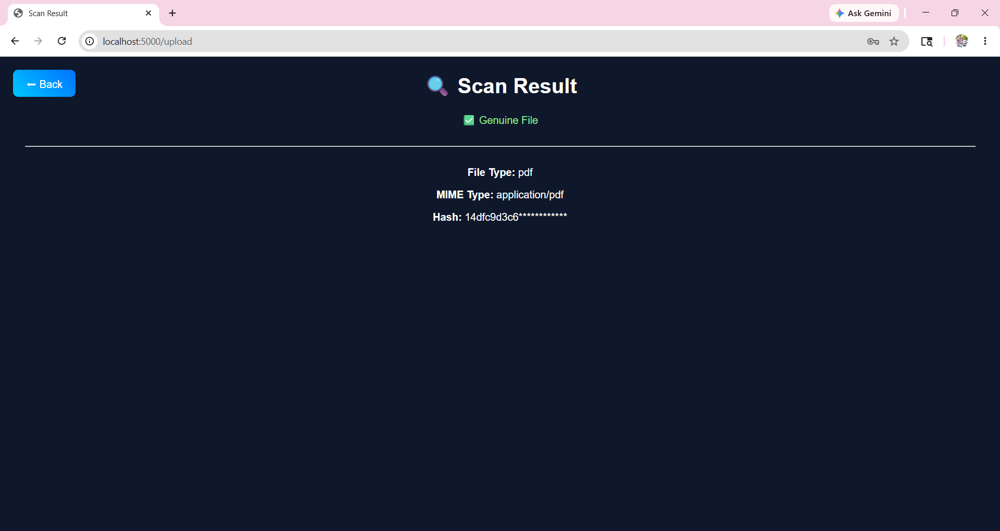

# Fake File Detection System

A Python and MySQL based Fake File Detection System developed using Flask framework.

## Features
- User Registration & Login
- Admin Panel
- Fake File Detection
- File Upload System
- MySQL Database Integration
- Password Recovery
- User Activity Monitoring

## Technologies Used
- Python
- Flask
- HTML
- CSS
- JavaScript
- MySQL

## Database
Database file included:
Dump20260522.sql

## Author
Bandi Lokesh
## Screenshots

### Home Page

### User Login Page

### Upload File Page

### Detection Result Page

### Admin Dashboard

